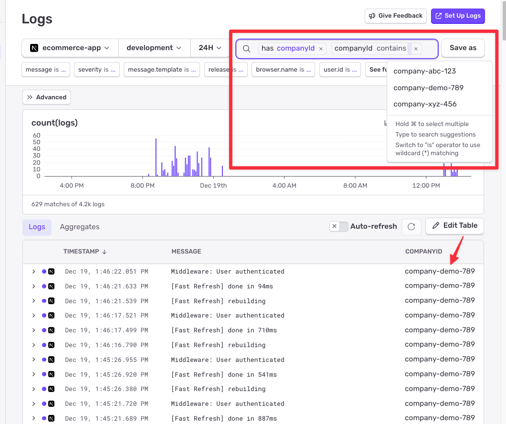

# Sentry CompanyID Implementation Guide

This guide documents the implementation of adding `companyId` as an attribute to all Sentry logs in a Next.js e-commerce application, enabling multi-tenant monitoring and log filtering.

---

### Key Challenge

Next.js applications run in three separate runtimes with **isolated Sentry instances**:

- **Client Runtime** (Browser): Persistent, per-user session
- **Edge Runtime** (Middleware): Per-request, V8 isolates
- **Server Runtime** (API Routes): Per-request, Node.js process

**Scopes do NOT propagate between these runtimes**, requiring different approaches for each.

---

## Architecture

### Data Flow Diagram

```
┌─────────────────────────────────────────────────────────┐
│  CLIENT (Browser)                                        │
│  • Storage: Global variable (sentryContext.ts)          │
│  • Setter: SentryUserContext component                  │
│  • Hook: beforeSendLog() → getClientCompanyId()         │
│  • Result: companyId attribute on all client logs       │
└─────────────────────────────────────────────────────────┘
                          ↓
                   HTTP Request
                          ↓
┌─────────────────────────────────────────────────────────┐
│  EDGE (Middleware)                                       │
│  • Storage: Sentry isolation scope (per-request)        │
│  • Setter: middleware.ts → setTag('companyId')          │
│  • Hook: beforeSendLog() → scope.tags.companyId         │
│  • Result: companyId attribute on middleware logs       │
│  ⚠️  Scope does NOT propagate to API routes             │
└─────────────────────────────────────────────────────────┘
                          ↓
                   Request continues
                          ↓
┌─────────────────────────────────────────────────────────┐
│  SERVER (API Routes - Node.js)                           │
│  • Storage: Sentry isolation scope (per-request)        │
│  • Setter: setSentryContext() in each route handler     │
│  • Hook: beforeSendLog() → scope.tags.companyId         │
│  • Result: companyId attribute on all API logs          │
└─────────────────────────────────────────────────────────┘
```

---

## Complete Request Flow - Step by Step

### Scenario: User Loads Page → Clicks Button → Makes API Call

```
1. User loads page in browser
   ↓
2. layout.tsx → SentryUserContext component renders
   │
   ├─→ setClientCompanyId("company-abc-123")  [stores globally]
   └─→ Sentry.setTag('companyId', "company-abc-123")  [for filtering]
   ↓
3. User clicks button → makes API call
   ↓
4. Browser console.log("User clicked button")
   │
   └─→ beforeSendLog() in instrumentation-client.ts
       │
       ├─→ getClientCompanyId() returns "company-abc-123"
       └─→ log.attributes.companyId = "company-abc-123" ✅
           log.attributes.setBy = "CLIENT-beforeSendLog"
   ↓
5. HTTP Request sent to /api/orders
   ↓
6. EDGE RUNTIME: middleware.ts runs
   │
   ├─→ getCurrentUser() reads session cookie
   ├─→ Sentry.setUser({ id, email, username })
   └─→ Sentry.getIsolationScope().setTag('companyId', "company-abc-123")
   │
   └─→ console.log("✅ [Middleware] User + companyId tag set")
       │
       └─→ beforeSendLog() in sentry.edge.config.ts
           │
           ├─→ scope.getScopeData().tags.companyId = "company-abc-123"
           └─→ log.attributes.companyId = "company-abc-123" ✅
               log.attributes.setBy = "EDGE-beforeSendLog"
   ↓
7. Request continues to NODE.JS RUNTIME: /api/orders
   │
   ├─→ await setSentryContext() called at route start
   ├─→ getCurrentUser() reads session (scope set for this request)
   ├─→ Sentry.setTag('companyId', "company-abc-123")
   └─→ console.log("✅ [API Route] Sentry companyId tag set")
       │
       └─→ beforeSendLog() in sentry.server.config.ts
           │
           ├─→ scope.getScopeData().tags.companyId = "company-abc-123"
           └─→ log.attributes.companyId = "company-abc-123" ✅
               log.attributes.setBy = "SERVER-beforeSendLog"
   ↓
8. Response sent back to browser
```

### What You'll See in Sentry

**Client-side log:**

```json
{
  "message": "✅ [Client] Sentry user + companyId set: company-abc-123",
  "companyId": "company-abc-123",
  "setBy": "CLIENT-beforeSendLog",
  "user.id": "user-2",
  "user.email": "bob@company-abc.com"
}
```

**Middleware log:**

```json
{
  "message": "✅ [Middleware] User + companyId tag set: company-abc-123",
  "companyId": "company-abc-123",
  "setBy": "EDGE-beforeSendLog",
  "user.id": "user-2",
  "user.email": "bob@company-abc.com"
}
```

**API Route log:**

```json
{
  "message": "✅ [API Route] Sentry companyId tag set: company-abc-123",
  "companyId": "company-abc-123",
  "setBy": "SERVER-beforeSendLog",
  "user.id": "user-2",
  "user.email": "bob@company-abc.com"
}
```

---

## Implementation Details

### 1. Client Runtime (Browser)

**Config File:** `src/instrumentation-client.ts`

**Key Methods:**

- `Sentry.init()` - Initialize Sentry SDK
- `beforeSendLog` - Hook to add companyId to every log before sending

**Storage:** Global variable in `src/lib/sentryContext.ts`

```typescript
// src/lib/sentryContext.ts
let currentCompanyId: string | null = null;

export function setClientCompanyId(companyId: string | null) {
  currentCompanyId = companyId;
}

export function getClientCompanyId(): string | null {
  return currentCompanyId;
}
```

**Setting CompanyId:** `src/components/SentryUserContext.tsx`

```typescript
useEffect(() => {
  // Store in global variable for beforeSendLog
  setClientCompanyId(companyId);

  // Also set as tag for filtering in Sentry UI
  Sentry.getIsolationScope().setTag("companyId", companyId);
}, [companyId]);
```

**Adding to Logs:** `src/instrumentation-client.ts`

```typescript
beforeSendLog: (log) => {
  // Primary: Get from global storage (set by SentryUserContext)
  let companyId = getClientCompanyId();

  // Fallback: Read from isolation scope tags (defensive programming)
  // Handles edge cases where companyId is set directly via Sentry API
  // without using our helper, or if the global variable is corrupted
  if (!companyId) {
    const isolationScope = Sentry.getIsolationScope();
    const scopeData = isolationScope.getScopeData();
    const tagValue = scopeData?.tags?.companyId;
    companyId = typeof tagValue === "string" ? tagValue : null;
  }

  if (companyId) {
    log.attributes = {
      ...log.attributes,
      companyId,
      setBy: isDevelopment ? "CLIENT-beforeSendLog" : undefined,
    };
  }
  return log;
};
```

**Why Global Variable?**  
`Sentry.getCurrentScope()` doesn't reliably return tags within `beforeSendLog` on the client side. The global variable bridges the gap between where companyId is set (component) and where it's read (hook).

**Why the Fallback?**  
The fallback to reading from isolation scope tags is defensive programming. Under normal operation, both the global variable and the tag are set simultaneously in `SentryUserContext`. The fallback handles edge cases like:

- Direct Sentry API usage bypassing our component
- Module loading order issues
- Global variable corruption
- Future code changes that might remove the global variable approach

---

### 2. Edge Runtime (Middleware)

**Config File:** `sentry.edge.config.ts`

**Key Methods:**

- `Sentry.init()` - Initialize Sentry SDK for edge runtime
- `beforeSendLog` - Hook to add companyId from isolation scope

**Setting CompanyId:** `src/middleware.ts`

```typescript
export async function middleware(request: NextRequest) {
  const user = await getCurrentUser();

  if (user) {
    // Set user context
    Sentry.setUser({
      id: user.id,
      email: user.email,
      username: user.name,
    });

    // Set companyId on isolation scope as a tag
    Sentry.getIsolationScope().setTag("companyId", user.companyId);

    // Log with Sentry logger (will have companyId attribute)
    Sentry.logger.info("Middleware: User authenticated", {
      userId: user.id,
      companyId: user.companyId,
    });
  }

  return NextResponse.next();
}
```

**Adding to Logs:** `sentry.edge.config.ts`

```typescript
beforeSendLog: (log) => {
  // Read from isolation scope where we set the tag
  const isolationScope = Sentry.getIsolationScope();
  const scopeData = isolationScope.getScopeData();
  const companyId = scopeData?.tags?.companyId;

  if (companyId) {
    log.attributes = {
      ...log.attributes,
      companyId,
      setBy: isDevelopment ? "EDGE-beforeSendLog" : undefined,
    };
  }
  return log;
};
```

---

### 3. Server Runtime (API Routes)

**Config File:** `sentry.server.config.ts`

**Key Methods:**

- `Sentry.init()` - Initialize Sentry SDK for server runtime
- `beforeSendLog` - Hook to add companyId from isolation scope

**Helper Function:** `src/lib/sentry-helpers.ts`

```typescript
/**
 * Sets Sentry context (user + companyId) for the current request.
 * MUST be called at the start of every API route handler.
 */
export async function setSentryContext(): Promise<void> {
  const user = await getCurrentUser();

  if (user) {
    // Set user context (optional but recommended)
    Sentry.setUser({
      id: user.id,
      email: user.email,
      username: user.name,
    });

    // Set companyId as tag (required - picked up by beforeSendLog)
    Sentry.getIsolationScope().setTag("companyId", user.companyId);
  }
}
```

**Why Set Both User Context AND CompanyId?**

These serve different purposes:

| What                  | Purpose                                                    | Required for CompanyId? |
| --------------------- | ---------------------------------------------------------- | ----------------------- |
| `setUser()`           | User identification - "Which specific user hit this bug?"  | ❌ No (but recommended) |
| `setTag('companyId')` | Multi-tenant filtering - "Show all errors for Company ABC" | ✅ Yes (essential)      |

**What you get in Sentry:**

```json
{
  "message": "Payment failed",
  "companyId": "company-abc-123", // ← From setTag() - Company-level tracking
  "user": {
    // ← From setUser() - User-level tracking
    "id": "user-2",
    "email": "bob@company-abc.com",
    "username": "Bob"
  }
}
```

**Could you skip `setUser()`?** Yes! If you only care about company-level tracking. But we include it because:

- ✅ Data is already available (reading from session anyway)
- ✅ No performance cost (lightweight operation)
- ✅ Richer debugging (knowing both company AND user helps)
- ✅ Sentry best practice (recommended for all applications)
- ✅ Enables user-level filtering ("Show all errors for bob@company-abc.com")

**Usage in API Routes:** All route handlers in `src/app/api/*/route.ts`

```typescript
export async function POST(request: NextRequest) {
  // CRITICAL: Set Sentry context FIRST (before try block)
  await setSentryContext();

  try {
    // Route logic here
    console.log("Processing order"); // Will have companyId ✅
  } catch (error) {
    console.error("Error:", error); // Will have companyId ✅
  }
}
```

**Adding to Logs:** `sentry.server.config.ts`

```typescript
beforeSendLog: (log) => {
  // Read from isolation scope where we set the tag
  const isolationScope = Sentry.getIsolationScope();
  const scopeData = isolationScope.getScopeData();
  const companyId = scopeData?.tags?.companyId;

  if (companyId) {
    log.attributes = {
      ...log.attributes,
      companyId,
      setBy: isDevelopment ? "SERVER-beforeSendLog" : undefined,
    };
  }
  return log;
};
```

**Why Call in Every Route?**  
Edge and Server runtimes are isolated - middleware scope does NOT propagate to API routes. Each API route must explicitly set the context.

---

## Understanding Sentry Scope Hierarchy

### Why `getIsolationScope()`?

Throughout this implementation, we use `Sentry.getIsolationScope()` instead of `getCurrentScope()` or `getGlobalScope()`. This is critical for security and correctness in Next.js.

### The Three Scope Levels

Sentry provides three scope levels in all JavaScript SDKs:

```typescript
// 1. Global Scope - Entire application lifetime
Sentry.getGlobalScope().setTag("environment", "production");
// ↳ Set once, applies to everything, never cleared

// 2. Isolation Scope - Request/Session lifetime
Sentry.getIsolationScope().setTag("companyId", "company-123");
// ↳ Server: Per-request isolation (we use this!)
// ↳ Client: Per-session (one user)

// 3. Current Scope - Operation/Transaction lifetime
Sentry.getCurrentScope().setTag("operation", "checkout");
// ↳ Specific to current operation/span
```

### Why Isolation Scope for CompanyId?

#### Server-Side: Request Isolation (Critical!)

```typescript
// ✅ CORRECT - Request-level isolation
Sentry.getIsolationScope().setTag("companyId", user.companyId);
```

**The Problem We're Solving:**

Next.js handles **concurrent requests** in the same Node.js process. Without proper scope isolation, data leaks between users:

```typescript
// ❌ DANGEROUS - Would leak between concurrent requests!
Sentry.getGlobalScope().setTag("companyId", user.companyId);

// Scenario:
// Request 1: Alice logs in (companyId: company-A)
Sentry.getGlobalScope().setTag("companyId", "company-A");

// Request 2: Bob logs in CONCURRENTLY (companyId: company-B)
Sentry.getGlobalScope().setTag("companyId", "company-B");

// Result: Alice's logs now show company-B! 🚨 Data leak!
```

**How Isolation Scope Fixes This:**

Next.js uses **async local storage** to provide per-request context isolation:

```typescript
// Request 1: User Alice (companyId: company-A)
Sentry.getIsolationScope().setTag("companyId", "company-A");
// ↳ Isolated to Request 1's async context

// Request 2: User Bob (companyId: company-B) - running concurrently!
Sentry.getIsolationScope().setTag("companyId", "company-B");
// ↳ Isolated to Request 2's async context

// Both requests run in same process but have isolated scopes! ✅
// Alice's logs always show company-A, Bob's always show company-B
```

#### Client-Side: Session Isolation

```typescript
// ✅ CORRECT - Session-level (one user, one browser)
Sentry.getIsolationScope().setTag("companyId", user.companyId);
```

**Why This Works:**

- Browser = single user session (no concurrent users)
- Isolation scope persists across page navigations
- Automatically inherited by all operations in the session
- Gets cleared/updated when user logs out and new user logs in

### Scope Hierarchy in Action

```
Global Scope (Application)
    ↓ inherits
Isolation Scope (Request/Session) ← We set companyId here!
    ↓ inherits
Current Scope (Operation/Transaction)
```

All scopes inherit from parent scopes:

- Tags set in Global Scope → visible in all scopes
- Tags set in Isolation Scope → visible in Current Scope
- Tags set in Current Scope → only in that scope

### Why Not Current Scope?

```typescript
// ⚠️ SUBOPTIMAL - Too narrow
Sentry.getCurrentScope().setTag("companyId", user.companyId);
```

Current scope is tied to specific operations/spans. In Next.js:

- Might not propagate to all logs in the request
- Could be lost between async operations
- Not guaranteed to persist for entire request lifecycle

**Isolation scope is the right level for request-wide or session-wide context.**

### Why Not `withScope()`?

You might wonder: "Why not use `Sentry.withScope()` to prevent data leaks?"

```typescript
// Could this work?
export async function POST(request: NextRequest) {
  return await Sentry.withScope(async (scope) => {
    scope.setTag("companyId", user.companyId);
    // ... entire route logic in callback
  });
}
```

**While `withScope()` would technically prevent data leaks between concurrent requests, it's not the right tool for Next.js:**

#### Problems with `withScope()`:

1. **Awkward API Route Structure**

   - Requires wrapping entire route handler in a callback
   - All logic must be nested inside the callback
   - Returns must be handled carefully

   ```typescript
   // ❌ Awkward and verbose
   export async function POST(request: NextRequest) {
     return await Sentry.withScope(async (scope) => {
       scope.setTag("companyId", user.companyId);

       // ENTIRE route must be inside this callback
       try {
         const result = await processOrder();
         return NextResponse.json(result);
       } catch (error) {
         return NextResponse.json({ error: "Failed" }, { status: 500 });
       }
     });
   }

   // ✅ Clean with isolation scope
   export async function POST(request: NextRequest) {
     Sentry.getIsolationScope().setTag("companyId", user.companyId);

     try {
       const result = await processOrder();
       return NextResponse.json(result);
     } catch (error) {
       return NextResponse.json({ error: "Failed" }, { status: 500 });
     }
   }
   ```

2. **Scope Lifetime Too Short**

   - The scope only exists inside the callback
   - Code outside the callback won't have the attributes
   - Would need multiple `withScope()` calls with duplicate attribute setting

3. **Wrong Semantic Purpose**

   - `withScope()` is designed for **operation-level isolation** (sending specific events)
   - Isolation scope is designed for **request-level or session-level context**

   ```typescript
   // ✅ Good use of withScope - one-off operation
   Sentry.withScope((scope) => {
     scope.setLevel("warning");
     scope.setTag("section", "payment");
     Sentry.captureMessage("Payment took longer than expected");
   });

   // ✅ Good use of isolation scope - entire request context
   Sentry.getIsolationScope().setTag("companyId", user.companyId);
   // Automatically available for entire request lifecycle
   ```

4. **Doesn't Integrate with Next.js Async Context**
   - Next.js uses async local storage for per-request isolation
   - `getIsolationScope()` integrates with this automatically
   - `withScope()` creates its own isolation that doesn't align with Next.js request boundaries

#### Comparison Summary

| Approach            | Prevents Leaks? | Ergonomics   | Semantic Fit | Next.js Integration |
| ------------------- | --------------- | ------------ | ------------ | ------------------- |
| **Global Scope**    | ❌ No           | ✅ Good      | ❌ Wrong     | ❌ No               |
| **withScope()**     | ✅ Yes          | ⚠️ Awkward   | ⚠️ Not ideal | ⚠️ Partial          |
| **Isolation Scope** | ✅ Yes          | ✅ Excellent | ✅ Perfect   | ✅ Full             |

**Bottom line:** While `withScope()` would technically prevent data leaks, **isolation scope is the right tool for the job in Next.js**. It's designed for exactly this use case: request-level or session-level context that needs to persist throughout the lifecycle but remain isolated between concurrent requests.

---

## Sentry Methods Reference

### Core Methods Used

| Method                                | Runtime | Purpose                            | Location                                 |
| ------------------------------------- | ------- | ---------------------------------- | ---------------------------------------- |
| `Sentry.init()`                       | All     | Initialize SDK                     | All config files                         |
| `Sentry.setUser()`                    | All     | Set user context                   | Middleware, API routes, Client component |
| `Sentry.getIsolationScope().setTag()` | All     | Set tags for filtering             | Middleware, API routes, Client component |
| `beforeSendLog`                       | All     | Hook to modify logs before sending | All config files                         |
| `Sentry.logger.info/error/warn()`     | All     | Log with Sentry's native logger    | Throughout app                           |
| `Sentry.consoleLoggingIntegration()`  | All     | Send console.log to Sentry         | All config files                         |
| `Sentry.captureException()`           | Server  | Capture errors with context        | API routes                               |
| `Sentry.addBreadcrumb()`              | Server  | Add context trail                  | API routes                               |
| `Sentry.startSpan()`                  | Server  | Create custom performance spans    | API routes                               |
| `Sentry.setContext()`                 | Server  | Add custom context to events       | API routes                               |

### Integration Methods

| Integration                    | Configuration                          | Purpose               |
| ------------------------------ | -------------------------------------- | --------------------- |
| `consoleLoggingIntegration`    | `{ levels: ["log", "error", "warn"] }` | Capture console logs  |
| `replayIntegration`            | Client only (production)               | Session replay        |
| `captureRouterTransitionStart` | Client only                            | Track page navigation |

### Configuration Options

```typescript
Sentry.init({
  dsn: process.env.NEXT_PUBLIC_SENTRY_DSN,

  // Performance monitoring
  tracesSampleRate: 1.0,

  // Session replay (client only, production only)
  replaysSessionSampleRate: isProduction ? 0.1 : 0,
  replaysOnErrorSampleRate: isProduction ? 1.0 : 0,

  // Enable logging
  enableLogs: true,

  // Hook to modify logs
  beforeSendLog: (log) => {
    /* ... */
  },

  // Integrations
  integrations: [
    Sentry.consoleLoggingIntegration({ levels: ["log", "error", "warn"] }),
  ],

  // Debug mode (development only)
  debug: isDevelopment,

  // Enable in all environments
  enabled: true,
});
```

---

## Expected Results

### Logs in Sentry

All authenticated user logs will include:

```json
{
  "message": "Order created successfully",
  "companyId": "company-abc-123",
  "setBy": "SERVER-beforeSendLog", // (dev only)
  "user": {
    "id": "user-2",
    "email": "bob@company.com"
  }
}
```

### Filtering in Sentry

Search by company: `companyId:company-abc-123`

Filter by runtime (dev only): `setBy:CLIENT-beforeSendLog`

### Logs Without CompanyId (Expected)

- Build/compilation logs (run before any user context)
- System startup logs
- Unauthenticated requests

---

## Querying and Filtering Logs in Sentry

Once your logs are flowing into Sentry with the `companyId` attribute, you can leverage Sentry's powerful query and filtering capabilities to analyze logs by company.

### Search and Filter by CompanyId



### Saved Searches

You can save frequently used queries for quick access:

1. Build your query (e.g., `companyId:company-abc-123`)
2. Click **"Save as"**
3. Name it (e.g., "Company ABC Logs")
4. Access from saved searches dropdown

### Integration with Other Sentry Features

The `companyId` attribute works seamlessly with:

- **Alerts:** Create company-specific alert rules
- **Discover:** Build custom queries combining logs and errors
- **Dashboards:** Visualize log volume and error rates per company
- **User Feedback:** Correlate user feedback with company-level log data

---

## Key Learnings

### ✅ What Works

1. **Client global variable** - Necessary because scope tags aren't reliably accessible in `beforeSendLog`
2. **Server helper function** - DRY approach, ensures consistency across all API routes
3. **Edge scope tags** - Works perfectly for middleware logs
4. **Calling before try blocks** - Ensures catch block logs also have companyId
5. **Separate configs for each runtime** - Each runtime needs its own `beforeSendLog` hook

### ❌ What Doesn't Work

1. **Assuming middleware scope propagates to API routes** - It doesn't in Next.js
2. **Using `setAttributes()` instead of `setTag()`** - `beforeSendLog` reads from tags, not attributes
3. **Calling setSentryContext() inside try block** - Error logs in catch won't have companyId
4. **Relying on `getCurrentScope()` on client** - Not reliable in `beforeSendLog` hook

---

## Testing & Verification

### 1. Development Console

Start the dev server and look for:

```
✅ [Client] Sentry user + companyId set: company-abc-123
✅ [Middleware] User authenticated
✅ [API] Sentry context set: user=user-2, companyId=company-abc-123
```

### 2. Sentry Dashboard

Check that logs include:

- `companyId` attribute
- `setBy` attribute (development only)
- User context (id, email)

### 3. Filtering

Test Sentry search:

- `companyId:company-abc-123` - All logs for specific company
- `setBy:CLIENT-beforeSendLog` - All client-side logs (dev only)

---

## Production Considerations

### Debug Attributes

The `setBy` attribute is automatically omitted in production:

```typescript
setBy: isDevelopment ? "CLIENT-beforeSendLog" : undefined;
```

### Session Replay

Session replay is production-only to avoid development noise:

```typescript
replaysSessionSampleRate: isProduction ? 0.1 : 0,
replaysOnErrorSampleRate: isProduction ? 1.0 : 0,
```

### Performance

- `setSentryContext()` runs once per API request (minimal overhead)
- No performance impact from global variable (simple reference)
- Tags are efficiently stored in Sentry scope

---

## Common Mistakes to Avoid

### ❌ Wrong: Context Inside Try Block

```typescript
export async function POST(request: NextRequest) {
  try {
    await setSentryContext(); // ← WRONG
    // logic
  } catch (error) {
    console.error("Error:", error); // ← No companyId!
  }
}
```

### ✅ Correct: Context Before Try Block

```typescript
export async function POST(request: NextRequest) {
  await setSentryContext(); // ← CORRECT

  try {
    // logic
  } catch (error) {
    console.error("Error:", error); // ← Has companyId! ✅
  }
}
```

### ❌ Wrong: Using setAttributes()

```typescript
Sentry.getIsolationScope().setAttributes({ companyId: user.companyId });
```

### ✅ Correct: Using setTag()

```typescript
Sentry.getIsolationScope().setTag("companyId", user.companyId);
```

---

## Checklist for New API Routes

When creating a new API route:

- [ ] Import `setSentryContext` from `@/lib/sentry-helpers`
- [ ] Call `await setSentryContext()` at the start of each handler
- [ ] Place the call **before** any try blocks
- [ ] Verify logs in Sentry include `companyId` attribute

---

## Summary

This implementation successfully adds `companyId` to all Sentry logs across three isolated Next.js runtimes. The solution:

- ✅ Uses appropriate patterns for each runtime environment
- ✅ Handles Next.js's isolated scope architecture
- ✅ Provides secure, multi-tenant log attribution
- ✅ Enables filtering and grouping by company in Sentry
- ✅ Production-ready with development-only debug info

**Key Insight:** Next.js's multi-runtime architecture requires different approaches for each environment. Understanding that middleware scope does NOT propagate to API routes is critical to implementing this correctly.
