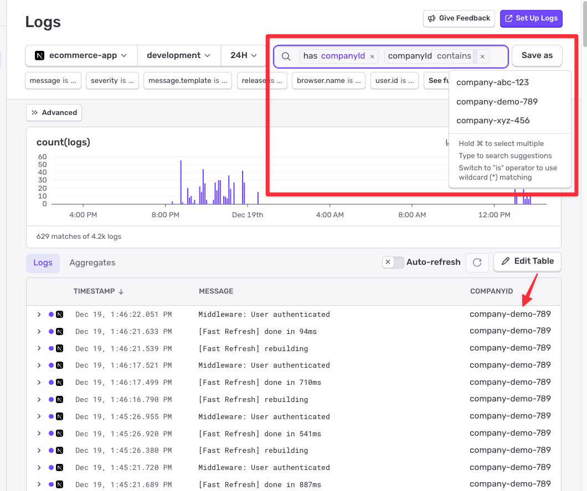

# Sentry CompanyID Implementation Guide (setAttribute API)

This guide documents adding `companyId` to all Sentry logs in Next.js for multi-tenant monitoring using the modern `setAttribute()` API (available in SDK v10.32.0+).

---

## Problem

Next.js runs three separate runtimes with **isolated Sentry instances**:

- **Client Runtime** (Browser): Persistent per-user session
- **Edge Runtime** (Middleware): Per-request V8 isolates
- **Server Runtime** (API Routes): Per-request Node.js process

**Scopes do NOT propagate between runtimes.** Each requires separate configuration.

---

## Architecture

### Data Flow Diagram

```
┌─────────────────────────────────────────────────────────┐
│  CLIENT (Browser)                                       │
│  • Storage: Sentry isolation scope (per-session)        │
│  • Setter: SentryUserContext component                  │
│  • API: setAttribute('companyId', value)                │
│  • Result: companyId attribute on all client logs       │
└─────────────────────────────────────────────────────────┘
                          ↓
                   HTTP Request
                          ↓
┌─────────────────────────────────────────────────────────┐
│  EDGE (Middleware)                                      │
│  • Storage: Sentry isolation scope (per-request)        │
│  • Setter: middleware.ts → setAttribute()               │
│  • Result: companyId attribute on middleware logs       │
│  ⚠️  Scope does NOT propagate to API routes             │
└─────────────────────────────────────────────────────────┘
                          ↓
                   Request continues
                          ↓
┌─────────────────────────────────────────────────────────┐
│  SERVER (API Routes - Node.js)                          │
│  • Storage: Sentry isolation scope (per-request)        │
│  • Setter: setSentryContext() in each route handler     │
│  • API: setAttribute('companyId', value)                │
│  • Result: companyId attribute on all API logs          │
└─────────────────────────────────────────────────────────┘
```

---

## Why setAttribute() is Better

### The Old Way (setTag + beforeSendLog)

```typescript
// Required complex beforeSendLog hooks in each config
beforeSendLog: (log) => {
  const scopeData = Sentry.getIsolationScope().getScopeData();
  const companyId = scopeData?.tags?.companyId;
  if (companyId) {
    log.attributes = { ...log.attributes, companyId };
  }
  return log;
};

// Plus global variable workaround for client-side
let currentCompanyId: string | null = null;
```

### The New Way (setAttribute)

```typescript
// Just set the attribute - SDK automatically applies it to logs
Sentry.getIsolationScope().setAttribute("companyId", user.companyId);

// That's it! No beforeSendLog hooks needed.
```

### Benefits

- **Less code** - No `beforeSendLog` hooks, no global variables
- **More reliable** - SDK handles attribute merging automatically
- **Cleaner architecture** - Direct API purpose-built for this use case
- **Same safety** - Isolation scope still prevents data leaks

---

## Implementation

### Sentry Configuration

All three runtimes (client, edge, server) use the same simple configuration:

```typescript
import * as Sentry from "@sentry/nextjs";

Sentry.init({
  dsn: process.env.NEXT_PUBLIC_SENTRY_DSN,
  enableLogs: true,
  integrations: [
    Sentry.consoleLoggingIntegration({ levels: ["log", "error", "warn"] }),
  ],
});
```

**No `beforeSendLog` hook needed!** The SDK automatically applies scope attributes to logs.

---

### Setting CompanyId in Each Runtime

Since Next.js runtimes don't share scope, you must set `companyId` in each:

**Client (`src/components/SentryUserContext.tsx`):**

```typescript
Sentry.getIsolationScope().setAttribute("companyId", companyId);
```

**Edge (`src/middleware.ts`):**

```typescript
const user = await getCurrentUser();
if (user) {
  Sentry.setUser({ id: user.id, email: user.email, username: user.name });
  Sentry.getIsolationScope().setAttribute("companyId", user.companyId);
}
```

**Server (`src/lib/sentry-helpers.ts`):**

```typescript
export async function setSentryContext(): Promise<void> {
  const user = await getCurrentUser();
  if (user) {
    Sentry.setUser({ id: user.id, email: user.email, username: user.name });
    Sentry.getIsolationScope().setAttribute("companyId", user.companyId);
  }
}
```

Call `setSentryContext()` at the start of every API route:

```typescript
export async function POST(request: NextRequest) {
  await setSentryContext(); // CRITICAL: Call BEFORE try block

  try {
    // Your route logic
  } catch (error) {
    console.error("Error:", error);
  }
}
```

---

### Logging Examples

Once `companyId` is set, **all logs automatically include it**:

**Using console.log (via consoleLoggingIntegration):**

```typescript
// These console logs will have companyId attribute in Sentry
console.log("Processing order", { orderId: "123" });
console.error("Payment failed", { error: "insufficient_funds" });
console.warn("Low stock", { productId: "456" });
```

**Using Sentry.logger directly:**

```typescript
// Sentry logger also gets companyId automatically
Sentry.logger.info("Order created", { orderId: "123", amount: 99.99 });
Sentry.logger.error("Database timeout", { duration: 5000 });
Sentry.logger.warn("Deprecated API used", { endpoint: "/old-api" });
```

**All logs in Sentry will have:**

```json
{
  "message": "Processing order",
  "companyId": "company-abc-123",
  "orderId": "123",
  "user": {
    "id": "user-456",
    "email": "user@company.com"
  }
}
```

---

## Critical: Scope Isolation

### Why `getIsolationScope()`?

Sentry provides three scope levels:

```typescript
// Global Scope - Entire application (NEVER use for user data)
Sentry.getGlobalScope().setAttribute("key", "value");

// Isolation Scope - Per-request/session (USE THIS)
Sentry.getIsolationScope().setAttribute("key", "value");

// Current Scope - Per-operation/transaction
Sentry.getCurrentScope().setAttribute("key", "value");
```

**Server-side:** Next.js handles concurrent requests in the same Node.js process. Using global scope causes data leaks between users:

```typescript
// ❌ Data leak between concurrent users
Sentry.getGlobalScope().setAttribute("companyId", user.companyId);

// Request 1: Alice (company-A) → sets attribute
// Request 2: Bob (company-B) → overwrites attribute
// Result: Alice's logs show company-B! 🚨

// ✅ CORRECT - Per-request isolation
Sentry.getIsolationScope().setAttribute("companyId", user.companyId);
// Isolated via async local storage - no data leaks
```

**Client-side:** Isolation scope persists across page navigations for single-user session.

### How setAttribute() Works

According to the [Sentry JavaScript SDK v10.32.0 release notes](https://github.com/getsentry/sentry-javascript/releases/tag/10.32.0):

> "Scope attributes are merged from all active scopes (current, isolation, global scopes) when the log is captured"

**Key Points:**

- **You SET** attributes on the isolation scope (per-request)
- **Sentry READS** from all scopes when capturing logs
- **Result:** Only the current request's `companyId` is included
- **Safety:** Isolation scope prevents data leaks in multi-tenant apps

---

## Common Mistakes

### ❌ Wrong: Context Inside Try Block

```typescript
export async function POST(request: NextRequest) {
  try {
    await setSentryContext(); // ← WRONG
    // logic
  } catch (error) {
    console.error("Error:", error); // ← No companyId!
  }
}
```

### ✅ Correct: Context Before Try Block

```typescript
export async function POST(request: NextRequest) {
  await setSentryContext(); // ← CORRECT

  try {
    // logic
  } catch (error) {
    console.error("Error:", error); // ← Has companyId ✅
  }
}
```

### ❌ Wrong: Using Global Scope

```typescript
// Can cause data leaks between concurrent requests
Sentry.getGlobalScope().setAttribute("companyId", user.companyId);
```

### ✅ Correct: Using Isolation Scope

```typescript
// Per-request isolation, no data leaks
Sentry.getIsolationScope().setAttribute("companyId", user.companyId);
```

---

## Attribute Behavior

### Supported Values

- **Primitives:** `string`, `number`, `boolean` ✅
- **Arrays/Objects:** Currently discarded (future support in v11)

### Single vs Multiple Attributes

The API provides two methods for setting attributes:

```typescript
// Single attribute (what we use in this implementation)
Sentry.getIsolationScope().setAttribute("companyId", user.companyId);

// Multiple attributes at once (useful if you have multiple context values)
Sentry.getIsolationScope().setAttributes({
  companyId: user.companyId,
  tenantId: user.tenantId,
  orgName: user.orgName,
  region: user.region,
});
```

Both methods work identically - scope attributes are automatically applied to all logs. Use whichever is more convenient for your use case.

### Attribute Precedence

Log attributes take precedence over scope attributes:

```typescript
// Set scope attribute
Sentry.getIsolationScope().setAttribute("companyId", "company-A");

// This log will have companyId: "company-B" (log attribute wins)
console.log("Test", { companyId: "company-B" });

// This log will have companyId: "company-A" (from scope)
console.log("Test");
```

---

## Querying and Filtering Logs in Sentry

Once your logs are flowing into Sentry with the `companyId` attribute, you can leverage Sentry's powerful query and filtering capabilities to analyze logs by company.

### Search and Filter by CompanyId



**Basic query syntax:**

```
companyId:company-abc-123
```

### Expected Log Structure

```json
{
  "message": "Order created successfully",
  "companyId": "company-abc-123",
  "user": {
    "id": "user-2",
    "email": "bob@company.com"
  }
}
```

### Saved Searches

You can save frequently used queries for quick access:

1. Build your query (e.g., `companyId:company-abc-123`)
2. Click **"Save as"**
3. Name it (e.g., "Company ABC Logs")
4. Access from saved searches dropdown

### Integration with Other Sentry Features

The `companyId` attribute works seamlessly with:

- **Alerts:** Create company-specific alert rules
- **Discover:** Build custom queries combining logs and errors
- **Dashboards:** Visualize log volume and error rates per company
- **User Feedback:** Correlate user feedback with company-level log data

### Logs Without CompanyId (Expected)

- Build/compilation logs
- System startup logs
- Unauthenticated requests

---

## Key Takeaways

1. **Three isolated runtimes** require three separate implementations
2. **Middleware scope does NOT propagate** to API routes
3. **Use `getIsolationScope().setAttribute()`** for per-request isolation
4. **Set context before try blocks** to ensure error logs have companyId
5. **No `beforeSendLog` hooks needed** - SDK handles it automatically
6. **Dramatically less code** than the setTag + beforeSendLog approach
7. **Same isolation safety** - no data leaks in multi-tenant apps

---

## Requirements

- **Sentry JavaScript SDK:** v10.32.0 or higher
- **Feature Added:** [Sentry JavaScript SDK v10.32.0](https://github.com/getsentry/sentry-javascript/releases/tag/10.32.0) (released Dec 18, 2024)

---

## Changelog: What Changed from Previous Version

This document represents a **major simplification** from the previous `setTag + beforeSendLog` approach. Here's what changed:

### Removed Components

1. **All `beforeSendLog` hooks** - No longer needed in any config file (client, edge, server)
2. **Global variable pattern** (`sentryContext.ts`) - Client-side global storage removed
3. **Scope data reading logic** - No more `getScopeData().tags` extraction code
4. **Dual storage system** - Eliminated client-side primary/fallback pattern

### API Changes

```typescript
// Old approach
Sentry.getIsolationScope().setTag("companyId", user.companyId);
// Required beforeSendLog hook to read tag and add to log attributes

// New approach
Sentry.getIsolationScope().setAttribute("companyId", user.companyId);
// SDK automatically applies attributes to logs - no hook needed
```

### Code Reduction

- **~90% less code** overall
- Client config: 30 lines → 10 lines
- Edge config: 20 lines → 10 lines
- Server config: 20 lines → 10 lines
- Removed entire `sentryContext.ts` file

### What Stayed the Same

- ✅ Still use `getIsolationScope()` for per-request/session isolation
- ✅ Still call `setSentryContext()` at the start of each API route
- ✅ Still set context before try blocks for error handling
- ✅ Still configure all three runtimes separately
- ✅ Same data leak protection via isolation scopes

### Why This Version is Better

- **Simpler architecture** - Direct SDK support instead of hooks
- **More reliable** - SDK handles attribute merging automatically
- **Easier to maintain** - Less custom code to debug
- **Same safety guarantees** - Isolation scope prevents data leaks
- **No getCurrentScope() issues** - Previous version had unreliable `getCurrentScope()` behavior in `beforeSendLog` hooks (especially client-side), requiring global variable workarounds. The new `setAttribute()` API eliminates this entirely since the SDK reads attributes automatically without needing `getCurrentScope()` calls.
